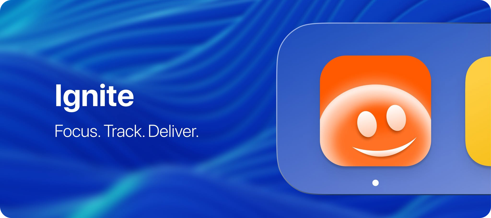

# Ignite

### Focus. Track. Deliver.

A distraction-free **macOS** menu-bar app that combines focus sessions, project & task management, automatic time tracking, AI meeting minutes, reporting, and invoicing — built for freelancers and focused professionals.

**[⬇ Download the latest version](../../releases/latest)**

---

## What is Ignite?

Ignite lives in your menu bar. Start a focus session and it tracks your deep work, keeps you honest with smart breaks, blocks distractions, quietly captures your meetings, and turns all of it into reports and client-ready invoices.

Everything runs **locally on your Mac** — no account, no cloud, no tracking.

## Features at a glance

- ⏱️ **Focus timer** — Pomodoro + manual count-up modes, with per-task tracking right from the menu bar.
- 🧘 **Smart breaks** — enforcement tiers, meeting-aware postponing, and wellness reminders (stretch, eyes, posture, hydration).
- 🚫 **Distraction blocking** — block apps & websites, on a schedule or during focus, with a "block now" override.
- 📁 **Projects, clients & tasks** — full hierarchy with priorities, due dates, billing, and editable tracked time.
- 🎙️ **Meetings & AI minutes** — auto-detects calls, transcribes on-device, and generates structured minutes (summary, decisions, action items).
- 📊 **Reports** — hours-per-day and time-by-project charts; export to A4 PDF or CSV.
- 🧾 **Invoices** — generated from tracked time, fully editable, with custom branding and A4 PDF export.
- 🖥️ **Dashboard** — focus, revenue, streaks, and billable split at a glance.

See **[HOW-IT-WORKS.md](docs/HOW-IT-WORKS.md)** for the full flow, and **[CHANGELOG.md](CHANGELOG.md)** for version history.

---

## Installation

1. Download **`Ignite.dmg`** from the [latest release](../../releases/latest).
2. Open the DMG and drag **Ignite** into your Applications folder.
3. **First launch:** right-click (or Control-click) the Ignite app and choose **Open**, then click **Open** again.
   > This step is only needed the first time. macOS shows a warning because the app isn't distributed through the App Store.

### Requirements
- macOS 14 (Sonoma) or later

---

## Permissions

Ignite only asks for what a feature needs, when you use it:

| Permission | Why |
|---|---|
| Notifications | Session and break alerts |
| Microphone + Speech | On-device meeting transcription (only while recording) |
| Automation (Safari/Chrome) | Closing distracting tabs during blocking |
| Network | AI meeting minutes (only when you press "Generate") |

All your data stays on your Mac. The only time anything leaves your device is an AI-minutes request you explicitly trigger, using your own API key.

---

## Optional: AI meeting minutes

To enable AI-generated minutes, add an Anthropic API key in **Settings → Meetings & AI**. It's stored locally and only used when you generate minutes.

---

Made for people who value deep work.

